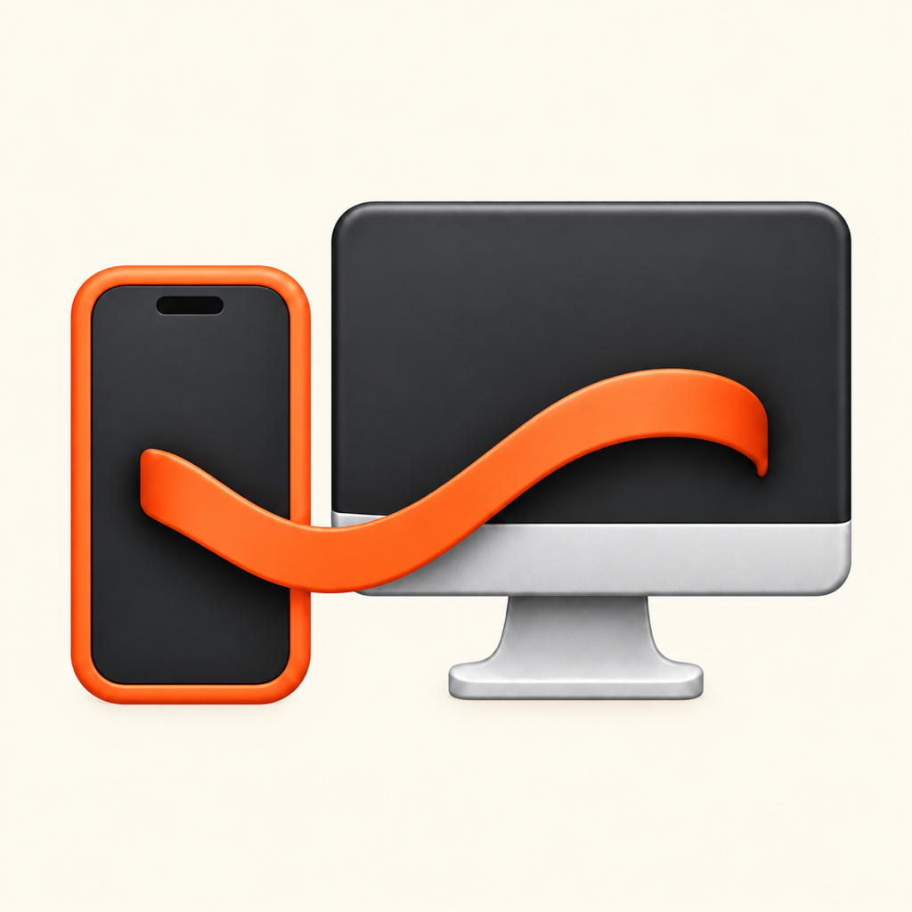

# NotifBridge



**Your iPhone notifications, on your Mac — through a Bluetooth relay.**

NotifBridge forwards notifications from an iPhone to native macOS banners and
Notification Center, with supported replies and actions sent back to the phone.
It uses Apple's accessory frameworks and an ESP32 relay; iPhone Mirroring is not
required.

**v1 is a source release for developers and hardware tinkerers.** You need an
ESP32, a compatible iPhone and Mac, and Apple signing/provisioning access. There
is no prebuilt, notarized installer or App Store distribution.

## Features

- Native macOS notifications with the source app's icon where supported.
- Reply and other actions when provided by the originating iPhone app.
- **Clear on iPhone** clears the phone notification and removes the Mac entry on
  confirmation. **X** dismisses only the Mac notification.
- iPhone removal events dismiss the corresponding Mac notifications.
- A menu-bar app with sound, quiet-notification and launch-at-login preferences.
- A chronological inbox with search, app filters, per-app muting, rich content,
  attachment previews/export and optional cleared history.
- Bluetooth reconnection, acknowledged delivery, duplicate suppression and
  recovery from interrupted key exchange.

The menu's **Test notification** is a local preview, not an iPhone delivery test.
It intentionally has no iPhone actions.

## Requirements

| Component | Requirement |
| --- | --- |
| iPhone | Real device running iOS 26.5 or newer; eligible for Apple's accessory notification forwarding |
| Mac | macOS 26 or newer with Bluetooth; automated tests currently target Apple silicon |
| Relay | ESP32 compatible with PlatformIO's `esp32dev` board, powered over USB |
| Tools | Xcode with the iOS 26.5+ SDK and XWing CryptoKit APIs, XcodeGen, PlatformIO |
| Signing | Apple Developer team and provisioning for the accessory extension entitlements |

Development has been performed with Xcode 27 and an iPhone 17. Simulator builds
cannot validate pairing or notification forwarding. Apple's regional/account
eligibility and notification-target restrictions apply; development was tested
with an EU account. Check [Apple's accessory notification documentation](https://developer.apple.com/documentation/accessorytransportextension/receiving-ios-notifications-on-an-accessory)
before buying hardware or applying for entitlements. An active Apple Watch
notification target can affect forwarding eligibility.

## Build and set up

### 1. Clone and install tools

```sh
git clone https://github.com/shinvou/NotifBridge.git
cd NotifBridge
brew install xcodegen
python3 -m venv .venv
.venv/bin/pip install platformio
```

Select your Xcode installation with `xcode-select` if more than one is installed.

### 2. Configure signing

The projects intentionally do not contain a developer team ID. Use your own team
and unique bundle identifiers. Replace `com.shinvou.NotifBridge` consistently in
both project specifications, entitlements, extension metadata and Swift sources,
including the app-group and shared Keychain identifiers. Keep extension bundle
identifiers under the iOS host application's identifier.

Generate the projects:

```sh
xcodegen generate --spec ios/project.yml
xcodegen generate --spec macos/project.yml
open ios/NotifBridge-iOS.xcodeproj
open macos/NotifBridge-macOS.xcodeproj
```

Set your team for the host apps and all three extensions. Provision the declared
accessory data-provider, transport-security and transport-extension entitlements.
An ordinary unsigned or simulator build is not sufficient for device use.
Changes made only in generated Xcode projects are overwritten by XcodeGen; keep
your signing settings locally or pass `DEVELOPMENT_TEAM=YOUR_TEAM` to xcodebuild.

### 3. Build and flash the relay

Connect the ESP32 with a data-capable USB cable:

```sh
PIO="$PWD/.venv/bin/pio" bash scripts/esp32-build.sh
PIO="$PWD/.venv/bin/pio" bash scripts/esp32-flash.sh
```

PlatformIO detects the serial port. If multiple devices are connected, pass
`--upload-port /dev/cu.YOUR_PORT` to the flash script. The relay advertises as
`NotifBdg`. This firmware uses Bluetooth; Wi-Fi credentials are not required.

**Do not erase flash during routine updates:** erasing also deletes Bluetooth
bonds and requires re-pairing. `scripts/esp32-erase.sh` is a recovery tool only.

### 4. Run both apps and pair

1. Build and run the Mac application, and allow Bluetooth and notifications.
2. Build and run the iOS application on your real iPhone.
3. Use the iPhone's accessory picker to pair the relay, then enable forwarding
   for your chosen apps.
4. Open **Notification inbox** from the Mac menu-bar item.
5. Trigger a real notification on the iPhone and check the Mac.

Install app updates in place to preserve pairing and local data. Keep both apps
and the relay on compatible versions of this repository's protocol.

## How it works

```text
iPhone notification → DataProvider → iOS encrypted transport
                    → Bluetooth → ESP32 → Bluetooth → Mac

Mac action → encrypted reverse command → ESP32 → iPhone transport
           → DataProvider → original notification action → result
```

Three iOS extensions handle content, security and transport. The Mac decrypts
messages, updates its local inbox and submits native notifications. Chunk
acknowledgments and a separate Mac acceptance receipt support retries without
posting duplicates. Key preparation and activation are journaled so interrupted
extension processes can recover. Once the Mac confirms its Bluetooth subscriptions,
it sends a bounded receiver-ready signal to wake the phone transport and restart
a pending partial frame. This does not guarantee recovery after process termination.

## Privacy and limitations

- No cloud service is required. Notification content is stored locally on the
  Mac, up to 100 entries and an 8 MiB content budget. Deleting Mac history does
  not clear the iPhone.
- Bluetooth pairing and the relay are part of the trust boundary. Key material
  is transported during setup; do not treat the ESP32 as an untrusted device.
  This project has not received an independent security audit.
- macOS permissions, Focus and alert style determine whether a submitted
  notification becomes a visible banner. Acceptance is not proof of a visible
  banner or audible sound.
- Quiet iPhone notifications alert on Mac by default, including previously unseen
  notifications recovered after an outage; this is configurable. Sound follows
  the Mac toggle. Already recorded notification IDs do not alert again.
- Clear and reply require an iPhone session. A timeout can leave an action's
  outcome uncertain; retrying a reply may send it twice. Retry deduplication is
  process-local, not an exactly-once guarantee.
- Retries and buffers are bounded. Extended outages or process termination may
  lose notifications. FIFO transport and serialized native submissions reduce
  reordering, but cannot guarantee original-time popup order across delayed
  iOS callbacks or reconnects.
- Native entries retain their initial content; updates refresh inbox history
  without reposting a banner. NotifBridge's badge remains the notification's
  app identity even when source artwork appears as the avatar.
- Attachments are bounded (256 KiB each, 1 MiB total); some rich formats cannot
  be previewed. Background execution remains controlled by iOS.

## Tests

On an Apple silicon Mac with the required SDK:

```sh
bash scripts/test-offline.sh
```

This runs wire/history, receiver, BLE writer, native actions, ordering,
restoration, delivery and real CryptoKit regressions. It does not require paired
hardware and does not prove end-to-end delivery.

For a paired, unlocked iPhone and a running relay:

```sh
xcrun devicectl list devices
DEVICE=YOUR_IPHONE_ID MAC_APP=/Applications/NotifBridge.app bash scripts/test-e2e.sh
# Optional: also exercise clearing the synthetic notification on iPhone
DEVICE=YOUR_IPHONE_ID MAC_APP=/Applications/NotifBridge.app CLEAR_ON_IPHONE=1 bash scripts/test-e2e.sh
```

The live test restarts the Mac app and launches the iPhone app. It checks a
synthetic receipt marker and, optionally, the iPhone clear acknowledgment.
Visible banners and actual third-party reply delivery require separate checks.
The iOS UI setup test changes pairing/forwarding permissions and is opt-in.

## Project layout

- `ios/` — SwiftUI companion app and three accessory extensions.
- `macos/` — menu-bar app, native notifications and inbox.
- `shared/` — wire protocol, receipts, key exchange and GATT constants.
- `esp32/` — PlatformIO BLE relay firmware.
- `scripts/` — build helpers and regression tests.

See [CONTRIBUTING.md](CONTRIBUTING.md) for development and bug reports,
[CHANGELOG.md](CHANGELOG.md) for release notes, and [LICENSE](LICENSE) for the MIT license.
